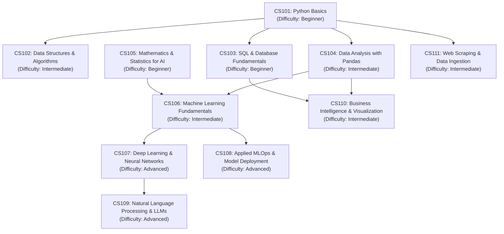
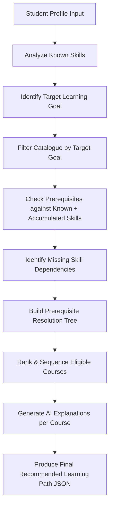
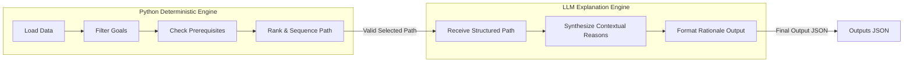
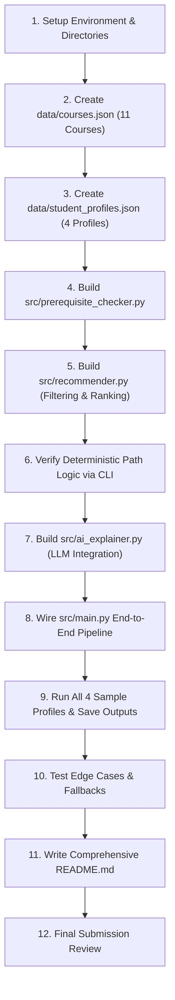

# PROJECT_PLAN.md: Course Recommendation Agent

---

## 1. Project Overview

### Problem Statement
Students seeking to learn new technical subjects often face overwhelming course options, unclear prerequisite paths, and generic course recommendations that fail to account for their existing skills or specific career/learning goals. Without structured guidance, learners risk enrolling in advanced courses prematurely or spending unnecessary time on topics they have already mastered.

### Agent Definition
> **"My agent takes a student profile (containing background, known skills, and learning goals) and produces a personalized, ordered learning path from a defined course catalogue, complete with prerequisite validation and AI-generated explanations for every step."**

### Main Goal
The primary objective of this project is to build a lightweight, deterministic, and reliable Python-based recommendation agent. It filters courses by goal relevance, validates prerequisite dependencies, ranks eligible courses, orders them into a logical learning progression, and leverages an LLM solely to generate rich, personalized explanations for each recommended course.

---

## 2. Challenge Requirements Checklist

| Requirement / Deliverable | Status / Approach | How Project Satisfies Requirement |
|---|---|---|
| **Student Background** | Planned | Captured in `student_profile.json` under `background` (e.g., non-technical, self-taught programmer, CS student). |
| **Student Goals** | Planned | Captured under `learning_goal` (e.g., `Data Analyst`, `Machine Learning Engineer`, `Python Developer`). |
| **Known Skills** | Planned | Captured as a list under `known_skills` (e.g., `["Python Basics", "Basic Math"]`). |
| **Course Catalogue** | Planned | JSON database (`data/courses.json`) containing 10–12 structured courses with metadata, skills, and goals. |
| **Course Prerequisites** | Planned | Explicitly declared per course in `courses.json` and validated deterministically by `prerequisite_checker.py`. |
| **Ordered Learning Path** | Planned | Courses are sequenced strictly according to prerequisite order and skill progression by `recommender.py`. |
| **Reason for Recommendation** | Planned | LLM module (`ai_explainer.py`) generates tailored rationale explaining why each course fits the student's profile. |
| **3–4 Sample Student Profiles** | Planned | 4 distinct profiles created in `data/student_profiles.json` covering beginner to advanced personas. |
| **Final Recommended Outputs** | Planned | Formatted JSON output files saved in `outputs/` for each student profile detailing the path and explanations. |

---

## 3. Project Scope

### In Scope
- **Domain**: Data Science & AI/ML Foundations (10–12 courses).
- **Data Models**: JSON files for course catalogue and student profiles.
- **Deterministic Recommendation Engine**: Rule-based Python module that filters by learning goals, resolves prerequisite trees, and orders learning steps.
- **AI Explanation Module**: Prompts an LLM (Gemini API) using strictly structured input data to synthesize personalized explanations without changing or adding courses.
- **Output Generator**: Writes structured execution results to JSON and prints formatted summaries to the console.
- **Edge Case Handling**: Fallbacks for missing skills, unknown skills, unsupported goals, and missing profile data.

### Out of Scope (7-Hour Limit Constraints)
- Interactive web frontend or web applications (CLI output and JSON files only).
- Database systems (PostgreSQL, MongoDB, etc.) — local JSON files will be used.
- User authentication, user sign-in, or session persistence.
- Dynamic web scraping or integration with external course APIs (Coursera, Udemy, etc.).
- Complex graph neural networks or machine-learning-based collaborative filtering recommendation engines.
- Microservices, Docker containerization, or cloud deployment pipelines.

---

## 4. Selected Learning Domain

### Domain: Data Science & AI/ML Foundations

### Rationale for Selection
1. **Clear Prerequisite Progression**: Mathematics and basic programming naturally precede data manipulation, which precedes machine learning and deep learning/LLMs.
2. **Easy to Model & Understand**: Skills like `Python Basics`, `Pandas`, `Statistics`, and `Machine Learning` have intuitive relationships.
3. **Versatile Student Profiles**: Supports clear differentiation across personas (e.g., absolute beginner vs. data analyst wanting to transition into AI engineering).
4. **Ideal for AI Explanations**: High semantic clarity allows the AI engine to produce compelling, contextual rationales for each learning step.

---

## 5. Student Profile Design

### Schema Fields
- `student_id` *(String)*: Unique identifier for the student (e.g., `"STUDENT_01"`).
- `name` *(String)*: Full name of the student.
- `background` *(String)*: Narrative summary of current role, education, or prior experience.
- `learning_goal` *(String)*: Target goal or career trajectory (must match supported catalog goals).
- `known_skills` *(List of Strings)*: Skills the student already possesses before taking courses.

### Conceptual Example
```json
{
  "student_id": "STUDENT_02",
  "name": "Sarah Chen",
  "background": "Marketing Analyst with basic spreadsheet skills and introductory Python knowledge",
  "learning_goal": "Data Analyst",
  "known_skills": ["Excel", "Python Basics"]
}
```

---

## 6. Course Catalogue Design

The catalogue consists of **11 focused courses** covering the Data Science & AI/ML domain.

### Schema Fields
- `course_id` *(String)*: Unique identifier (e.g., `"CS101"`).
- `course_name` *(String)*: Title of the course.
- `description` *(String)*: Summary of course coverage.
- `skills_taught` *(List of Strings)*: Skills acquired upon completing the course.
- `prerequisites` *(List of Strings)*: Skills required before taking this course.
- `difficulty` *(String)*: `Beginner`, `Intermediate`, or `Advanced`.
- `supported_goals` *(List of Strings)*: Career/learning goals this course contributes toward.

### Course Dependency Flow



### Complete Course List Summary
1. `CS101`: Python Basics (Skills: `Python Basics`)
2. `CS102`: Data Structures & Algorithms (Prereqs: `Python Basics` | Skills: `Data Structures`)
3. `CS103`: SQL & Database Fundamentals (Prereqs: None | Skills: `SQL`)
4. `CS104`: Data Analysis with Pandas & NumPy (Prereqs: `Python Basics` | Skills: `Pandas`, `Data Analysis`)
5. `CS105`: Mathematics & Statistics for AI (Prereqs: None | Skills: `Linear Algebra`, `Statistics`)
6. `CS106`: Machine Learning Fundamentals (Prereqs: `Python Basics`, `Pandas`, `Statistics` | Skills: `Machine Learning`, `Scikit-Learn`)
7. `CS107`: Deep Learning & Neural Networks (Prereqs: `Machine Learning` | Skills: `Deep Learning`, `PyTorch`)
8. `CS108`: Applied MLOps & Model Deployment (Prereqs: `Machine Learning`, `Python Basics` | Skills: `MLOps`, `FastAPI`)
9. `CS109`: Natural Language Processing & LLMs (Prereqs: `Deep Learning` | Skills: `NLP`, `LLMs`, `Prompt Engineering`)
10. `CS110`: Business Intelligence & Visualization (Prereqs: `SQL`, `Data Analysis` | Skills: `Data Visualization`, `Tableau/PowerBI`)
11. `CS111`: Web Scraping & Data Ingestion (Prereqs: `Python Basics` | Skills: `Web Scraping`, `API Ingestion`)

---

## 7. Recommendation Logic

### Process Flow Diagram



### Step-by-Step Logic Breakdown

1. **Input Ingestion**: Load student profile (`background`, `learning_goal`, `known_skills`) and full course catalogue.
2. **Goal Filtering**: Select all courses in the catalogue whose `supported_goals` includes the student's `learning_goal`.
3. **Dependency Resolution**:
   - Maintain a set of `accumulated_skills` initialized with `known_skills`.
   - Iterate over goal-relevant courses. If a course has unsatisfied `prerequisites` not in `accumulated_skills`, locate candidate courses in the catalogue that teach those missing prerequisite skills and prepend them to the target pool.
4. **Loop & Sequence**:
   - Identify courses whose prerequisites are fully satisfied by `accumulated_skills`.
   - Among eligible courses, pick the next course based on clear priority rules (Prerequisite unblocking -> Goal relevance -> Difficulty progression -> Catalogue order).
   - Append selected course to `ordered_path`.
   - Add `skills_taught` by selected course to `accumulated_skills`.
   - Repeat until all necessary courses required for the goal are included in `ordered_path`.
5. **Validation**: Python validates that every recommended course exists in the approved course catalogue, all prerequisites were satisfied prior to step insertion, and the path terminates at the target goal's topics before producing the final output.
6. **Explanation Generation**: Pass the ordered path, student background, and skill progression to the LLM to generate individualized rationale text for each course step.

---

## 8. Simple Ranking Strategy

When multiple courses are eligible to be taken next (meaning all their prerequisites are currently satisfied), the recommender selects and orders them using a simple, priority-based ranking strategy rather than complex mathematical formulas.

### Priority Rules

1. **Prerequisite Unblocking Priority**: If a course prerequisite is missing, prioritize the prerequisite course before the advanced course to unblock downstream requirements.
2. **Goal-Required Priority**: First prioritize courses directly required to reach the student's learning goal.
3. **Prerequisite Readiness Filter**: Only recommend courses whose prerequisites are currently satisfied or can logically be completed earlier in the generated learning path.
4. **Difficulty Progression Priority**: Prefer beginner courses before intermediate courses, and intermediate courses before advanced courses (`Beginner` → `Intermediate` → `Advanced`).
5. **Catalogue Order Tie-Breaker**: If multiple courses are equally suitable under all priority rules, use the course catalogue order (e.g., lower `course_id` first).

### Pseudocode
```python
def select_next_course(eligible_courses, target_goal, goal_missing_prereqs):
    # Rule 1: Prioritize missing prerequisite courses needed for target goal
    prereq_courses = [c for c in eligible_courses if any(s in c["skills_taught"] for s in goal_missing_prereqs)]
    if prereq_courses:
        candidates = prereq_courses
    else:
        # Rule 2: Prioritize courses directly supporting target goal
        goal_courses = [c for c in eligible_courses if target_goal in c["supported_goals"]]
        candidates = goal_courses if goal_courses else eligible_courses

    # Rule 4 & 5: Sort candidates by difficulty progression, then catalogue order
    difficulty_order = {"Beginner": 1, "Intermediate": 2, "Advanced": 3}
    candidates.sort(key=lambda c: (difficulty_order.get(c["difficulty"], 99), c["course_id"]))
    
    return candidates[0]
```

---

## 9. AI Model Role vs Python Role

To establish a clear separation of concerns and maintain consistent system behavior, responsibilities are strictly divided between Python deterministic code and the AI model.



### Python / Deterministic Logic Responsibilities
- Parse input JSON files (`courses.json`, `student_profiles.json`).
- Perform prerequisite checking and skill dependency resolution.
- Apply priority-based ranking rules and sequence the course path.
- Python validates that every recommended course exists in the approved course catalogue.
- Validation is performed before producing the final output.

### AI Model (LLM) Responsibilities
- Read the student's personal `background`, `learning_goal`, and the Python-selected course path.
- The AI is used only to generate personalized explanations for courses already selected by the deterministic recommendation logic.
- Explain **why** each course was selected specifically for this student in encouraging, human-understandable terms.
- Highlight how each course bridges the gap between their current background and ultimate goal.

### Why This Separation Makes the System Reliable
- **Reduced Risk of Hallucinations**: The system reduces the risk of hallucinated course recommendations by restricting the AI to explaining courses selected from the catalogue.
- **Deterministic Validity**: Prerequisite logic and ordering are enforced by deterministic Python code before passing the path to the AI.
- **High Quality Personalization**: The LLM focuses purely on natural language expression and contextual synthesis, where generative AI excels.

---

## 10. Expected Output

### Schema Structure
- `student_id` *(String)*
- `student_name` *(String)*
- `learning_goal` *(String)*
- `initial_known_skills` *(List of Strings)*
- `recommended_learning_path` *(List of Objects)*:
  - `step` *(Integer)*
  - `course_id` *(String)*
  - `course_name` *(String)*
  - `difficulty` *(String)*
  - `skills_acquired` *(List of Strings)*
  - `prerequisite_status` *(String)*: Summary of how prerequisites were met (e.g. `"Satisfied by Known Skills: [Python Basics]"`).
  - `recommendation_reason` *(String)*: AI-generated personalized rationale.

### Conceptual Output Example
```json
{
  "student_id": "STUDENT_02",
  "student_name": "Sarah Chen",
  "learning_goal": "Data Analyst",
  "initial_known_skills": ["Excel", "Python Basics"],
  "recommended_learning_path": [
    {
      "step": 1,
      "course_id": "CS103",
      "course_name": "SQL & Database Fundamentals",
      "difficulty": "Beginner",
      "skills_acquired": ["SQL"],
      "prerequisite_status": "No prerequisites required.",
      "recommendation_reason": "Given your experience with Excel spreadsheets as a Marketing Analyst, learning SQL is the natural next step to query databases directly."
    },
    {
      "step": 2,
      "course_id": "CS104",
      "course_name": "Data Analysis with Pandas & NumPy",
      "difficulty": "Intermediate",
      "skills_acquired": ["Pandas", "Data Analysis"],
      "prerequisite_status": "Satisfied by Known Skills: [Python Basics]",
      "recommendation_reason": "Since you already know Python Basics, CS104 will build upon your foundation to enable complex data cleaning and statistical analysis."
    },
    {
      "step": 3,
      "course_id": "CS110",
      "course_name": "Business Intelligence & Visualization",
      "difficulty": "Intermediate",
      "skills_acquired": ["Data Visualization", "Tableau/PowerBI"],
      "prerequisite_status": "Satisfied by completed steps CS103 (SQL) & CS104 (Data Analysis)",
      "recommendation_reason": "This course connects your new SQL and Pandas skills directly back to your marketing background by translating raw analytics into executive dashboards."
    }
  ]
}
```

---

## 11. Sample Data and Testing Plan

### 4 Sample Student Profiles

1. **Profile 1: Absolute Beginner (`STUDENT_01`)**
   - *Background*: High school teacher with no coding experience.
   - *Goal*: `Data Analyst`
   - *Known Skills*: `[]`
   - *Test Objective*: Verify engine recommends prerequisite entry courses (`CS101: Python Basics`, `CS103: SQL`) before intermediate courses (`CS104: Pandas`).

2. **Profile 2: Foundational Student (`STUDENT_02`)**
   - *Background*: Marketing Analyst with basic Python.
   - *Goal*: `Data Analyst`
   - *Known Skills*: `["Excel", "Python Basics"]`
   - *Test Objective*: Verify engine skips `CS101` and starts directly at `CS103` / `CS104`.

3. **Profile 3: Intermediate Student (`STUDENT_03`)**
   - *Background*: Junior Software Developer wanting to transition to Machine Learning.
   - *Goal*: `Machine Learning Engineer`
   - *Known Skills*: `["Python Basics", "Data Structures", "SQL", "Linear Algebra", "Statistics"]`
   - *Test Objective*: Verify engine detects missing `Pandas` skill, recommends `CS104`, then immediately transitions to `CS106` (ML) and `CS108` (MLOps).

4. **Profile 4: Advanced AI Target (`STUDENT_04`)**
   - *Background*: Experienced Data Scientist seeking specialized LLM mastery.
   - *Goal*: `AI Research Specialist`
   - *Known Skills*: `["Python Basics", "Pandas", "Statistics", "Machine Learning", "Scikit-Learn"]`
   - *Test Objective*: Verify engine skips introductory ML and builds path through `CS107` (Deep Learning) to `CS109` (NLP & LLMs).

### Edge Cases to Test
- **No Known Skills**: Empty list `[]` — should gracefully build path from level 1 prerequisites.
- **Unknown/Irrelevant Skills**: e.g., `["Graphic Design", "French"]` — should ignore unrecognised skills without error.
- **Unsupported Goal**: e.g., `Cybersecurity Specialist` — should return a friendly error message listing valid goals.
- **Missing Student Information**: Missing `learning_goal` field — should trigger clear input validation error.

---

## 12. Technology Plan

### Recommended Technology Stack
- **Language**: Python 3.10+
- **Data Format**: Standard JSON (`json` module in Python stdlib).
- **Environment Management**: `python-dotenv` for loading API keys securely from `.env`.
- **AI SDK**: Google GenAI SDK (`google-genai`) or standard HTTP requests using `urllib` / `requests` / `openai`.
- **System / File I/O**: Python standard libraries (`os`, `sys`, `json`, `pathlib`).

### Why Minimal Stack is Essential
- Ensures zero setup friction or environment conflict on Windows/PowerShell.
- Guarantees execution within the 7-hour constraint.
- Standard libraries execute fast and keep debugging straightforward.

---

## 13. Planned Project Structure

```
course-recommendation-agent/
│
├── data/
│   ├── courses.json               # Catalogue of 11 courses with prerequisites & goals
│   └── student_profiles.json      # 4 sample student profiles + edge case profiles
│
├── src/
│   ├── __init__.py
│   ├── main.py                    # Entry point: runs recommendations for all profiles
│   ├── prerequisite_checker.py    # Validates and resolves course prerequisite graph
│   ├── recommender.py             # Core deterministic filtering & ranking engine
│   └── ai_explainer.py            # Interfaces with LLM to generate personalized reasons
│
├── outputs/                       # Holds generated JSON output files per student
│   ├── STUDENT_01_path.json
│   ├── STUDENT_02_path.json
│   ├── STUDENT_03_path.json
│   └── STUDENT_04_path.json
│
├── PROJECT_PLAN.md                # Master architectural planning document
├── README.md                      # Setup instructions, architecture overview & guide
├── requirements.txt               # Dependencies (google-genai, python-dotenv)
├── .env.example                   # Environment key template
└── .gitignore                     # Git exclusion rules
```

### Module Responsibilities
- `data/courses.json`: Single source of truth for catalogue data.
- `data/student_profiles.json`: Test data containing 4 primary personas.
- `src/prerequisite_checker.py`: Graph resolution module. Determines if prerequisites are met and identifies missing skill prerequisites.
- `src/recommender.py`: Orchestrates course filtering by goal, calls prerequisite checker, prioritizes eligible courses, and emits ordered course lists.
- `src/ai_explainer.py`: Takes ordered course lists and student metadata, sends prompt to LLM, and attaches generated explanations to each course step.
- `src/main.py`: Command-line script to execute the agent across all test profiles and save results to `outputs/`.

---

## 14. Implementation Order



### Detailed Steps

1. **Setup Environment**: Initialize directory structure, create `.env`, `.gitignore`, `requirements.txt`.
   - *Success Criteria*: Directory tree matches Section 13.
2. **Create Course Catalogue (`data/courses.json`)**: Populate 11 data science courses with complete prerequisite mappings.
   - *Success Criteria*: Valid JSON with 11 well-defined courses.
3. **Create Student Profiles (`data/student_profiles.json`)**: Construct 4 representative profiles covering all difficulty ranges.
   - *Success Criteria*: Valid JSON with 4 detailed student records.
4. **Implement Prerequisite Checker (`src/prerequisite_checker.py`)**: Functions to check prerequisite readiness and missing skills.
   - *Success Criteria*: Unit function accurately returns true/false and missing dependencies.
5. **Implement Recommender Engine (`src/recommender.py`)**: Goal filtering, priority ranking, and topological path generation.
   - *Success Criteria*: Given `STUDENT_02`, generates ordered course list without prerequisite violations.
6. **CLI Verification**: Test deterministic output without AI explainer.
   - *Success Criteria*: Valid ordered paths printed for all 4 profiles.
7. **Implement AI Explainer (`src/ai_explainer.py`)**: API connection with fallback template if API key is unconfigured.
   - *Success Criteria*: Generates tailored 2-sentence rationale per course step.
8. **Build Main Pipeline (`src/main.py`)**: Orchestrate end-to-end flow from profile loading to output generation.
   - *Success Criteria*: Runs clean CLI execution with status logging.
9. **Generate Sample Outputs**: Write result JSON files to `outputs/`.
   - *Success Criteria*: 4 JSON files formatted according to Section 10 schema.
10. **Test Edge Cases**: Run tests against empty skills, unknown goals, and missing fields.
    - *Success Criteria*: System handles all gracefully with helpful feedback.
11. **Finalize Documentation (`README.md`)**: Write project documentation, running instructions, and architecture description.
    - *Success Criteria*: Clear, complete guide for reviewers.
12. **Final Submission Review**: Verify against Section 2 checklist.

---

## 15. 7-Hour Development Plan

| Time Window | Estimated Duration | Focus Area | Deliverables |
|---|---|---|---|
| **Hour 0:00 - 0:30** | 30 Mins | Planning & Architecture | Finalize `PROJECT_PLAN.md` & workspace structure |
| **Hour 0:30 - 1:15** | 45 Mins | Data Design | Construct `courses.json` (11 courses) and `student_profiles.json` (4 profiles) |
| **Hour 1:15 - 2:45** | 1.5 Hours | Core Python Engine | Implement `prerequisite_checker.py` and `recommender.py` logic |
| **Hour 2:45 - 3:45** | 1 Hour | AI Integration | Implement `ai_explainer.py` with prompt template & LLM API client |
| **Hour 3:45 - 4:45** | 1 Hour | Testing & Edge Cases | Debug path ordering, validate edge cases, handle missing API key fallback |
| **Hour 4:45 - 5:30** | 45 Mins | Outputs & Docs | Generate 4 output JSON files in `outputs/` & write `README.md` |
| **Hour 5:30 - 7:00** | 1.5 Hours | Buffer & Polish | Final verification against challenge requirements & code cleanup |

---

## 16. Design Decisions and Tradeoffs

### Key Design Decisions
- **Local JSON Catalogue**: Avoids external network latency, database setup overhead, and API rate limits.
- **Deterministic Rule Engine for Pathing**: Python selects and sequences courses based on prerequisites; the AI model is used only to generate explanations for courses selected from the catalogue.
- **Single Focused Domain (Data Science/AI)**: Provides realistic depth and clear skill trees without domain bloat.
- **Graceful LLM Fallback**: If no API key is provided, `ai_explainer.py` uses rule-based explanatory templates, ensuring the application always runs seamlessly.

### Limitations
- **Catalogue Size**: 11 courses represent a subset of a full university curriculum.
- **Static Skill Set**: Does not model course failure or adaptive re-planning during active enrollment.
- **Single Target Goal**: Assumes student pursues one primary learning goal per recommendation session.

### Future Improvements
- Interactive Web Interface (built with Vite + React or Streamlit).
- Dynamic Skill Assessment quizzes to evaluate known skills automatically.
- Multi-goal learning paths (e.g. Full-Stack Developer + Data Engineer hybrid).

---

# IMPLEMENTATION HANDOFF

This section consolidates all key specifications so implementation can proceed directly without redesign.

### 1. Final Learning Domain
- **Data Science & AI/ML Foundations**

### 2. Course Catalogue Structure (`data/courses.json`)
Contains 11 courses: `CS101` through `CS111`.
Fields: `course_id`, `course_name`, `description`, `skills_taught`, `prerequisites`, `difficulty`, `supported_goals`.

### 3. Student Profile Structure (`data/student_profiles.json`)
Contains 4 profiles (`STUDENT_01` to `STUDENT_04`).
Fields: `student_id`, `name`, `background`, `learning_goal`, `known_skills`.

### 4. Prerequisite Rules
- A course can only be added to a student's path if all items in its `prerequisites` list are present in `known_skills` or have been acquired by completing prior steps in the recommended path.
- Missing prerequisites are automatically resolved by finding and prepending the minimal set of courses that teach those missing skills.

### 5. Recommendation Flow
- `Student Profile` -> `Filter Target Goal Courses` -> `Resolve Prerequisite Tree` -> `Prioritize & Order Steps` -> `Generate AI Rationale` -> `Save Output JSON`.

### 6. Ranking Rules
- Priority-based selection order:
  1. Unblock missing prerequisites required for the target goal.
  2. Direct relevance to target learning goal.
  3. Difficulty progression (`Beginner` → `Intermediate` → `Advanced`).
  4. Tie-breaker: catalogue course order (`course_id`).

### 7. AI Model Responsibility
- Receives: `student_background`, `learning_goal`, `course_name`, `skills_acquired`, `prerequisite_status`.
- Produces: `recommendation_reason` (1–2 personalized sentences). The AI is used only to generate personalized explanations for courses already selected from the approved catalogue by Python.

### 8. Python Engine Responsibility
- File loading, schema validation, prerequisite dependency resolution, priority ranking, path sequencing, catalogue verification, and saving output JSON files.

### 9. Project Directory Structure
```
course-recommendation-agent/
├── data/
│   ├── courses.json
│   └── student_profiles.json
├── src/
│   ├── main.py
│   ├── recommender.py
│   ├── prerequisite_checker.py
│   └── ai_explainer.py
├── outputs/
├── PROJECT_PLAN.md
├── README.md
├── requirements.txt
├── .env.example
└── .gitignore
```

### 10. Implementation Sequence
1. Create directories and config files (`.env.example`, `.gitignore`, `requirements.txt`).
2. Create `data/courses.json` and `data/student_profiles.json`.
3. Build `src/prerequisite_checker.py`.
4. Build `src/recommender.py`.
5. Build `src/ai_explainer.py`.
6. Build `src/main.py`.
7. Execute pipeline and save outputs in `outputs/`.
8. Create `README.md` and complete final review.
