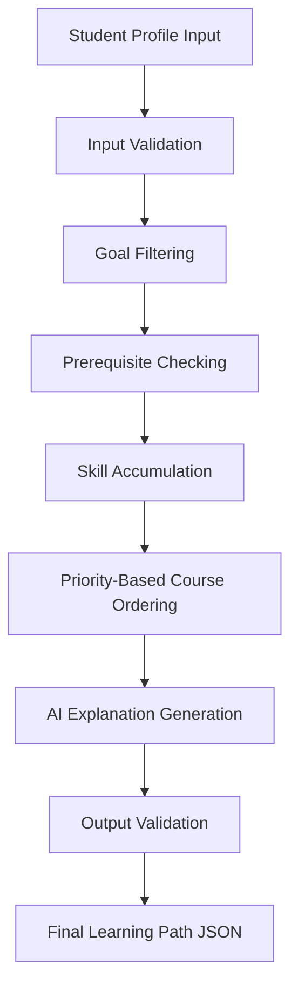

# Course Recommendation Agent

---

## 1. Project Overview

Students seeking to learn new technical subjects often face overwhelming course options, unclear prerequisite paths, and generic course recommendations that fail to account for their existing skills or specific career/learning goals. Without structured guidance, learners risk enrolling in advanced courses prematurely or spending unnecessary time on topics they have already mastered.

> **"My agent takes a student profile containing background, goals, and known skills and produces a personalized, ordered learning path from a defined course catalogue, with prerequisite validation and reasons for each recommendation."**

The primary objective of this project is to build a lightweight, deterministic, and reliable Python-based recommendation agent. It filters courses by goal relevance, validates prerequisite dependencies, ranks eligible courses using clear priority rules, orders them into a logical learning progression, and leverages an LLM solely to generate rich, personalized explanations for each recommended course.

---

## 2. Challenge Requirements

| Requirement | Implementation Status | Evidence / Location |
|---|---|---|
| **Student Background** | Implemented | Captured in `data/student_profiles.json` under `background` |
| **Student Goals** | Implemented | Captured in `data/student_profiles.json` under `learning_goal` |
| **Known Skills** | Implemented | Captured in `data/student_profiles.json` under `known_skills` |
| **Course Catalogue** | Implemented | 11 data science courses defined in `data/courses.json` |
| **Course Prerequisites** | Implemented | Validated deterministically by `src/prerequisite_checker.py` |
| **Ordered Learning Path** | Implemented | Sequenced by `src/recommender.py` following priority rules |
| **Reason for Recommendation** | Implemented | Generated by `src/ai_explainer.py` with fallback templates |
| **3–4 Sample Student Profiles** | Implemented | 4 distinct student personas in `data/student_profiles.json` |
| **Recommended Outputs** | Implemented | Valid JSON output files saved in `outputs/*.json` |
| **Runnable End-to-End Agent** | Implemented | Command-line entry point script `src/main.py` |

---

## 3. How the Agent Works

The Course Recommendation Agent follows a strict 8-step pipeline that separates deterministic selection logic from AI explanation generation:



1. **Student Profile Input**: Reads student background, learning goal, and known skills.
2. **Input Validation**: Verifies all required profile fields exist and are formatted correctly.
3. **Goal Filtering**: Filters the course catalogue to find courses that support the student's target goal.
4. **Prerequisite Checking**: Checks whether a course's prerequisites are met by the student's known skills or previously completed steps.
5. **Skill Accumulation**: As courses are selected, their taught skills are added to the student's accumulated skill set.
6. **Priority-Based Course Ordering**: Ranks and sequences eligible courses using deterministic rules (unblocking dependencies → goal relevance → difficulty progression → catalogue order).
7. **AI Explanation Generation**: Prompts the LLM (or uses template fallback) to generate a personalized rationale for each selected step.
8. **Output Validation & JSON Generation**: Validates path safety and writes submission JSON files to `outputs/`.

---

## 4. Python vs AI Responsibilities

To ensure predictable behavior and eliminate course hallucinations, the agent strictly divides responsibilities between Python code and the AI model:

### Python Engine
- Loads and parses JSON data files (`courses.json`, `student_profiles.json`).
- Validates student input profile structure.
- Filters catalogue courses by target learning goal.
- Checks prerequisite dependencies against known and accumulated skills.
- Builds, ranks, and orders the complete learning path.
- Validates course IDs, path integrity, and output format.
- Saves structured JSON results to disk.

### AI Explanation Model
- Generates 1–2 sentence personalized explanations for each course step.
- Connects the selected course to the student's specific background and learning goal.
- **Does NOT select courses**, remove courses, or reorder courses.
- **Does NOT define or modify prerequisites** or invent non-existent course titles.

### Rationale for Separation
- **Predictable Validity**: Deterministic Python code guarantees that prerequisites are respected and course paths are mathematically valid.
- **Reduced Risk of Hallucinations**: Restricting the AI to explaining pre-selected courses prevents the LLM from inventing non-existent courses or invalid prerequisite chains.
- **Enhanced User Experience**: The AI focuses on natural language personalization, where generative models perform best.

---

## 5. Project Structure

```
course-recommendation-agent/
│
├── data/
│   ├── courses.json               # Catalogue of 11 Data Science & AI courses
│   └── student_profiles.json      # 4 sample student input profiles
│
├── src/
│   ├── __init__.py                # Package initializer
│   ├── main.py                    # End-to-end pipeline runner & CLI entry point
│   ├── prerequisite_checker.py    # Prerequisite dependency validation module
│   ├── recommender.py             # Goal filtering & priority-based course path ordering
│   ├── ai_explainer.py            # LLM explanation generator with fallback mode
│   └── test_suite.py              # Suite of 8 validation and edge-case integration tests
│
├── outputs/                       # Final output JSON recommendations per student
│   ├── .gitkeep                   # Tracks output folder structure in git
│   ├── STUDENT_01_path.json
│   ├── STUDENT_02_path.json
│   ├── STUDENT_03_path.json
│   └── STUDENT_04_path.json
│
├── PROJECT_PLAN.md                # Architectural plan & single source of truth
├── README.md                      # Comprehensive user documentation & submission guide
├── requirements.txt               # Required Python dependencies
├── .env.example                   # Environment variable template file
└── .gitignore                     # Git exclusion rules
```

---

## 6. Installation

### 1. Clone or Navigate to the Repository
```bash
cd course-recommendation-agent
```

### 2. Create and Activate a Virtual Environment (Optional but Recommended)

**On Windows (PowerShell):**
```powershell
python -m venv .venv
.\.venv\Scripts\Activate.ps1
```

**On macOS/Linux:**
```bash
python3 -m venv .venv
source .venv/bin/activate
```

### 3. Install Dependencies
```bash
pip install -r requirements.txt
```

---

## 7. Environment Configuration

The AI explanation module uses environment variables to authenticate with the Gemini API.

1. Copy `.env.example` to create a local `.env` file:
   ```bash
   cp .env.example .env
   ```
2. Open `.env` and set your API key:
   ```env
   GEMINI_API_KEY=your_actual_gemini_api_key_here
   ```

*Note: If no API key is configured or network connection is unavailable, the agent automatically engages deterministic fallback explanations, ensuring the system runs smoothly without errors.*

---

## 8. Running the Agent

### Command-Line Interface (CLI)
To execute the complete recommendation pipeline for all sample student profiles via terminal:

```bash
python src/main.py
```

### Streamlit Web User Interface (UI)
To launch the interactive Web UI dashboard in your browser:

```bash
streamlit run app.py
```

### What Happens When Executed:
1. The CLI script runs integration tests and processes all 4 sample student profiles.
2. The Streamlit Web UI launches a local web server (`http://localhost:8501`) allowing interactive student profile entry and path generation.
3. For each student, Python filters goal-relevant courses, calculates topological prerequisite ordering, applies priority rules, and enriches the path with personalized explanations.
4. Output results are printed to the console / web interface and saved as individual JSON files in the `outputs/` directory.

---

## 9. Sample Input

Below is a real sample student profile from `data/student_profiles.json` (`STUDENT_03`):

```json
{
  "student_id": "STUDENT_03",
  "name": "Marcus Vance",
  "background": "Junior Software Engineer with a solid programming and mathematics foundation, wanting to transition into ML engineering.",
  "learning_goal": "Machine Learning Engineer",
  "known_skills": [
    "Python Basics",
    "Data Structures",
    "SQL",
    "Linear Algebra",
    "Statistics"
  ]
}
```

---

## 10. Sample Output

Below is a real output snippet from [`outputs/STUDENT_03_path.json`](file:///c:/Users/akshitha/Desktop/course-recommendation-agent/outputs/STUDENT_03_path.json):

```json
{
  "student_id": "STUDENT_03",
  "student_name": "Marcus Vance",
  "learning_goal": "Machine Learning Engineer",
  "initial_known_skills": [
    "Python Basics",
    "Data Structures",
    "SQL",
    "Linear Algebra",
    "Statistics"
  ],
  "recommended_learning_path": [
    {
      "step": 1,
      "course_id": "CS104",
      "course_name": "Data Analysis with Pandas & NumPy",
      "difficulty": "Intermediate",
      "skills_acquired": [
        "Pandas",
        "Data Analysis"
      ],
      "prerequisite_status": "All prerequisites satisfied: Python Basics",
      "selection_rule": "Prerequisite Unblocking (satisfies required prerequisite for downstream goal courses)",
      "recommendation_reason": "As step 1 of your journey toward becoming a Machine Learning Engineer, Data Analysis with Pandas & NumPy establishes the key foundational skills (Pandas, Data Analysis) suited for your background."
    },
    {
      "step": 2,
      "course_id": "CS106",
      "course_name": "Machine Learning Fundamentals",
      "difficulty": "Intermediate",
      "skills_acquired": [
        "Machine Learning",
        "Scikit-Learn"
      ],
      "prerequisite_status": "All prerequisites satisfied: Python Basics, Pandas, Statistics",
      "selection_rule": "Prerequisite Unblocking (satisfies required prerequisite for downstream goal courses)",
      "recommendation_reason": "Building upon your prior preparation, Machine Learning Fundamentals equips you with Machine Learning, Scikit-Learn, directing your progress toward your ultimate goal of becoming a Machine Learning Engineer."
    }
  ]
}
```

---

## 11. Sample Student Profiles Summary

1. **`STUDENT_01` (Alex Rivera)**: Absolute beginner with no coding skills seeking to become a `Data Analyst`. Demonstrates starting from level-1 foundational courses (`CS101`, `CS103`).
2. **`STUDENT_02` (Sarah Chen)**: Foundational student with basic Python & Excel skills seeking to become a `Data Analyst`. Demonstrates skipping `CS101` (Python Basics) because the skill is already known.
3. **`STUDENT_03` (Marcus Vance)**: Intermediate software engineer seeking to become a `Machine Learning Engineer`. Demonstrates prerequisite gap resolution (`CS104: Pandas` recommended before `CS106: Machine Learning`).
4. **`STUDENT_04` (Dr. Elena Rostova)**: Experienced data scientist seeking to become an `AI Research Specialist`. Demonstrates skipping introductory ML and progressing directly into `CS107` (Deep Learning) and `CS109` (LLMs).

---

## 12. Recommendation Logic

When multiple courses are eligible to be taken next (all prerequisites satisfied), the agent orders them using four clear priority rules:

1. **Prerequisite Unblocking Priority**: Prioritize courses that teach prerequisite skills required by downstream courses for the student's target goal.
2. **Goal Relevance Priority**: Prioritize courses directly relevant to the student's target learning goal.
3. **Difficulty Progression Priority**: Prefer a natural learning progression (`Beginner` → `Intermediate` → `Advanced`).
4. **Catalogue Order Tie-Breaker**: If courses are otherwise equal, use catalogue order (`course_id`).

---

## 13. Testing

The agent includes a comprehensive test suite in [`src/test_suite.py`](file:///c:/Users/akshitha/Desktop/course-recommendation-agent/src/test_suite.py) covering 8 validation scenarios:

```bash
python src/test_suite.py
```

### Test Results Summary
- **Total Test Scenarios**: 8
- **Passed**: 8
- **Failed**: 0

### Key Edge Cases Tested
- **No Known Skills**: Handled gracefully, recommending level-1 entry courses.
- **Unknown Skills**: Ignored unrecognized skills (e.g. `"Graphic Design"`, `"French"`) without crashing or misinterpreting prerequisites.
- **Unsupported Goal**: Returned a clear status message listing valid goals (e.g. for `"Cybersecurity Specialist"`).
- **Missing Profile Data**: Input validator flagged missing profile fields.
- **AI Fallback & Path Preservation**: Verified that AI enrichment never modifies course IDs, step count, or course ordering.

---

## 14. AI Fallback

If `GEMINI_API_KEY` is missing or an API network request fails, `src/ai_explainer.py` automatically engages template-based fallback rationales.

```text
Step 1 Fallback Reason: "As step 1 of your journey toward becoming a Data Analyst, Python Basics establishes the key foundational skills (Python Basics) suited for your background."
```

This design ensures the recommendation agent remains 100% operational and outputs valid submission files even when offline.

---

## 15. Design Decisions

- **Python**: Provides clean, fast standard library execution for graph and rule processing.
- **JSON**: Simple, human-readable data format for catalogue, profile, and output storage.
- **Deterministic Prerequisite Logic**: Ensures prerequisite dependencies and course sequencing are mathematically valid every time.
- **Priority-Based Ranking**: Avoids complex numerical weight tuning in favor of explainable priority rules.
- **LLM Explanations**: Uses generative AI where it excels—producing warm, personalized natural language rationales.
- **Local Sample Data**: Enables instant offline testing without external database setup.

---

## 16. Limitations

- **Catalogue Size**: catalogue contains 11 data science & AI courses.
- **Single Target Goal**: Processes one primary learning goal per recommendation session.
- **Static Sample Profiles**: Does not model dynamic student course drops or exam failures mid-enrollment.
- **AI Explanation Variability**: Generated explanation text may vary slightly across API calls while course selection remains fixed.

---

## 17. Future Improvements

- **Interactive Web Interface**: A visual dashboard built with Vite + React or Streamlit.
- **Dynamic Skill Assessment**: Adaptive diagnostic quizzes to verify self-reported skills.
- **Multi-Goal Paths**: Support for hybrid career paths (e.g. Data Engineer + Machine Learning Engineer).

---

## Final Challenge Checklist

| Requirement | Evidence / Location |
|---|---|
| **Student profile input** | [`data/student_profiles.json`](file:///c:/Users/akshitha/Desktop/course-recommendation-agent/data/student_profiles.json) |
| **Course catalogue** | [`data/courses.json`](file:///c:/Users/akshitha/Desktop/course-recommendation-agent/data/courses.json) |
| **Prerequisites** | [`src/prerequisite_checker.py`](file:///c:/Users/akshitha/Desktop/course-recommendation-agent/src/prerequisite_checker.py) |
| **Ordered learning paths** | [`src/recommender.py`](file:///c:/Users/akshitha/Desktop/course-recommendation-agent/src/recommender.py) |
| **Personalized rationale** | [`src/ai_explainer.py`](file:///c:/Users/akshitha/Desktop/course-recommendation-agent/src/ai_explainer.py) |
| **4 sample profiles** | [`data/student_profiles.json`](file:///c:/Users/akshitha/Desktop/course-recommendation-agent/data/student_profiles.json) |
| **Final outputs** | [`outputs/STUDENT_01_path.json`](file:///c:/Users/akshitha/Desktop/course-recommendation-agent/outputs/STUDENT_01_path.json) to [`outputs/STUDENT_04_path.json`](file:///c:/Users/akshitha/Desktop/course-recommendation-agent/outputs/STUDENT_04_path.json) |
| **Runnable agent** | [`src/main.py`](file:///c:/Users/akshitha/Desktop/course-recommendation-agent/src/main.py) |
| **Testing** | [`src/test_suite.py`](file:///c:/Users/akshitha/Desktop/course-recommendation-agent/src/test_suite.py) |
